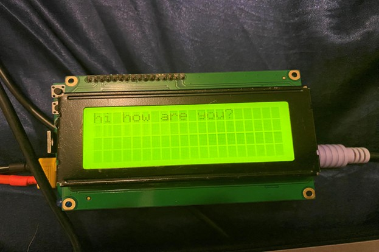
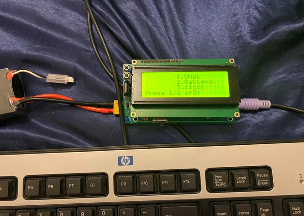

# RF-Based Secure Wireless Communication System

##  Project Description
The RF-based secure wireless communication system enables reliable and versatile wireless communication using the **Infineon XC888 microcontroller**, an **LCD display**, a **PS/2 keyboard**, and an **NRF24L01 transceiver**.  

It facilitates wireless data transfer between two systems with additional features such as **battery percentage monitoring** and **clock display**.

---

##  System Overview
- **Microcontroller:** XC888  
- **Display:** 20x4 LCD  
- **Input:** PS/2 keyboard  
- **Wireless Communication:** NRF24L01 transceiver  
- **Power Supply:** 7.4V LiPo battery  

---
## Block Diagram

---
## Schemetic
[Open the PDF](schemetic.pdf)

##  Key Features

###  Wireless Communication
- Uses **NRF24L01** for robust and efficient wireless data transfer  
- Supports **two-way communication** (transmit + receive)

###  User Interface
- LCD shows messages, battery percentage, and time  
- PS/2 keyboard allows direct message entry  

###  Message Input & Display
- Users can enter messages up to **32 characters**  
- Entered messages are displayed on the LCD  
- Clock feature shows the current time  

###  Battery Monitoring
- Monitors and displays real-time battery percentage  
- Alerts users about remaining battery life  

---

##  Operation

1. **System Start-Up**  
   - Initializes MCU, LCD, keyboard, and NRF24L01  
   - LCD welcomes user and prompts choice: **Chat**, **Battery**, or **Clock**  

2. **Message Entry**  
   - User types via PS/2 keyboard  
   - Message is shown live on LCD (max 32 chars)  

3. **Wireless Communication**  
   - Entered message transmitted wirelessly  
   - Receiving system displays it on its LCD  

4. **Battery & Clock Display**  
   - LCD continuously shows **battery %** and **time**  

---

##  Hardware Components

- **XC888 Microcontroller**
- **LCD Display (20×4)**  
  - Data: P3.0 – P3.7  
  - Control: P4.5, P4.6  
- **PS/2 Keyboard + Battery Monitor**
- **NRF24L01+ RF Module** (with 74LV1T3GV voltage translator)  
  - CE → P0.7 (OUT)  
  - CSN → P0.6 (OUT)  
  - IRQ → P0.5 (IN)  
  - MOSI → P0.4 (OUT)  
  - SCK → P0.3 (OUT)  
  - MISO → P0.0 (IN)  
- **Voltage Regulators**  
  - LM2575 (5V 1A)  
  - AMS1117-3.3V (1A, dropout 1.1V)  
- **7.4V 6000mAh Li-Po Battery** (XT60 connector + slide switch)  

---

##  Software Structure

### PS/2 Keyboard Interface
- Reads **scan codes** (MAKE + BREAK codes) from keyboard  
- Converts scan codes → ASCII → LCD output  
- Serial protocol: 1 start, 8 data bits, 1 parity, 1 stop  

### NRF24L01+ RF Module
- Air data rates: **250 kbps / 1 Mbps / 2 Mbps**  
- 2.4 GHz RF channel, ultra-low power  
- SPI communication, packet-based protocol  

### Flow
1. Initialize system & peripherals  
2. Welcome message → user selects **Chat**, **Battery**, or **Clock**  
3. Handle key presses (via ASCII conversion)  
   - `1` → Chat  
   - `2` → Battery loop  
   - `3` → Clock loop  

### Clock Loop
- Maintains and displays **HH:MM:SS**  
- Updates every second  
- Option to exit with **ESC**  

### Battery Loop
- Reads battery voltage via ADC  
- Displays voltage + % on LCD  
- Updates periodically  

---

##  Learning Outcomes

This project provided hands-on experience in embedded systems and electronics:

1. **LCD Programming** → Sending commands & ASCII to display text/numbers  
2. **PS/2 Interface** → Reading scan codes, converting to ASCII  
3. **Clock Management** → Internal timers for real-time applications  
4. **PCB Design** → CAD design, assembly, soldering SMDs  
5. **Interrupt Service Routines (ISR)** → Handling time-critical tasks  
6. **SPI Communication** → Interface with RF modules and peripherals  
7. **RF Communication** → Wireless data transfer using NRF24L01  
8. **Battery Monitoring** → ADC-based voltage measurement & percentage calc  
9. **Power Management** → Optimizing battery efficiency  
10. **Debugging & Troubleshooting** → Hardware/software issue resolution  
11. **Documentation & Presentation** → Professional reporting of outcomes  

---

##  Conclusion
The project demonstrates a **secure, user-friendly wireless communication system** built around the XC888 MCU.  

It integrates **RF communication, LCD display, keyboard input, battery monitoring, and clock management**, providing a practical example of embedded system design.  

This project also strengthened skills in **hardware design, software development, debugging, and documentation**.

---
